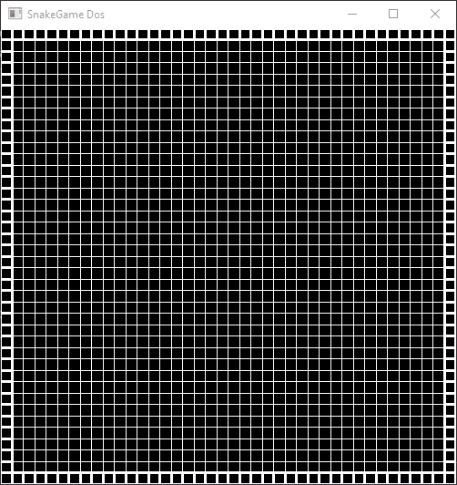
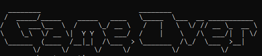

# SnakeGame

### Pure c++ Project : Using CLion

Simply put this is the old classic snake game. I will program this using c/c++. 

|     Build     |                              Stack                               |
|:-------------:|:----------------------------------------------------------------:|
| Uno - Console |  Printing to console, the game of snake! Standard  c++ libs  |
|   Dos - 2D    | Using a 2D Graphics lib like OpenGL make a beautiful sprite game |
|   Tres - 3D   |                  Get game working in a 3D world                  |
|  Quadro - XR  | Use oculus native libs to get a passthrough game cabinet working |

## Current Build 

### Dos
 - 
 - V 0.5
 - Moving animations on a grid using glRects and GLUTTimer functions 
 - Static screen size
 - Static grid size

### Uno  
 - V 1.0
 -  
 - Currently working and downloadable. Crafted in c++ and runs in a console window.
 - Close to zero artistic exploration 
 - [Download](https://wakuminc.itch.io/snakeuno)

